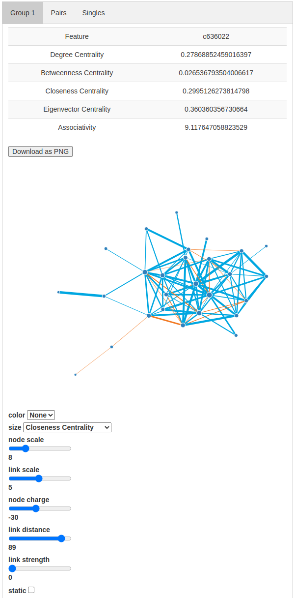
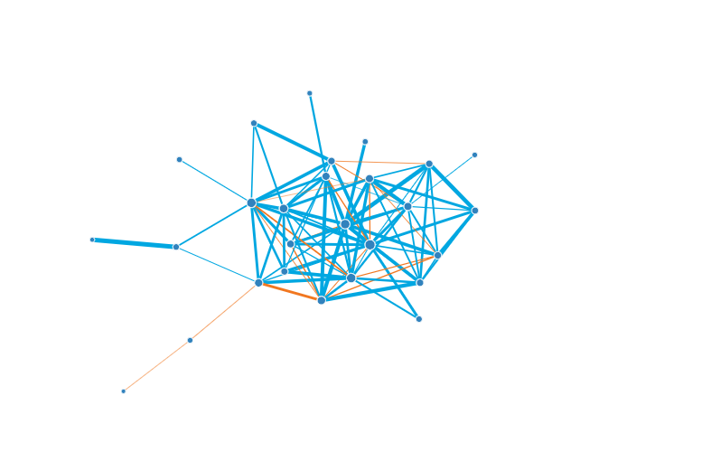
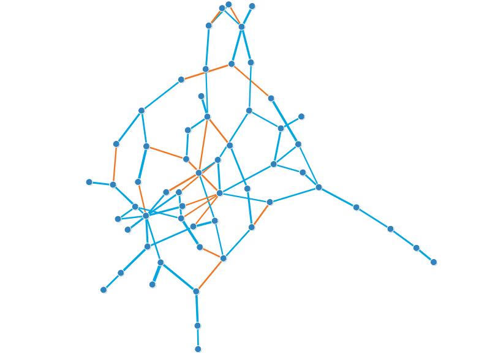

# q2-makarsa


q2-makarsa is a plugin to incorporate some functionality from the
[SpiecEasi](https://github.com/zdk123/SpiecEasi) and
[FlashWeave](https://github.com/meringlab/FlashWeave.jl) packages into the
QIIME 2 environment together with additional network visualisation.

## What is involved

### QIIME2


[QIIME 2](https://qiime2.org/) is a powerful, extensible, and decentralized
microbiome analysis package with a focus on data and analysis transparency.
QIIME 2 enables researchers to start an analysis with raw DNA sequence data and
finish with publication-quality figures and statistical results.

### SpiecEasi

[SpiecEasi](https://github.com/zdk123/SpiecEasi) (Sparse InversE Covariance
estimation for Ecological Association and Statistical Inference) is an [R
based](https://www.r-project.org/) package which allows the user to infer
microbial ecological networks from compositional datasets typically generated
from 16S amplicon sequencing. 

### FlashWeave 

[FlashWeave](https://github.com/meringlab/FlashWeave.jl) is a
[Julia](https://julialang.org/) based package which predicts ecological
interactions between microbes from large-scale compositional abundance data
(e.g., ASV or OTU tables constructed from sequencing data) through statistical
co-occurrence or co-abundance. It reports direct associations, with adjustment
for bystander effects and other confounders, and can furthermore integrate
environmental or technical factors into the analysis of microbial systems.

### Plug-in Features

q2-makarsa is at the $\alpha$ stage. In addition to wrapping the SpiecEasi and
FlashWeave packages it provides a visualisation for generated networks. As
development continues additional features will be listed here.

* All of SpiecEasi's features are exposed to the user except batch-mode execution (thread-level parallelism is supported)
* All of FlashWeave's `learn_network` features are exposed
* Visualisation features
  * Relationships between features (eg. ASVs, OTUs, MVs, taxa, peptides) are represented as ecological networks
  * The network is interactive and its overall size and shape on the
		  screen can be manipulated manually.
  * An image of the network can be saved to the local device in PNG
		  format.
  * Network nodes can be selected and information on which feature is
		  represented by the node, statistics, and various centrality measures
		  for the node will be displayed.
  * Network edges are colour coded for positive (blue) and negative
  (orange) correlations
  * Edge thickness is scaled according to statistics appropriate to each method with thicker edges indicating stronger connections between features.
  * Node size is scaled according user-selected statistics such as
  centrality measures.
  * Nodes are colour coded according to user-selected categories such as
  taxonomic classification
  * Synchronises settings across tabs meaning that if you have multiple
  tabs open in the visualisation, any changes you make to the settings
  (such as the scaling of edges or nodes) will be applied to all tabs
  at once.
  * Node attributes can be added via feature metadata (eg. taxonomy, DNA sequence, differential abundance scores)
    * If node attributes are taxonomic labels, visualisation offers
			  colourings at any taxonomic level

## Installation

q2-makarsa requires a working QIIME 2 environment, installed using conda.
Please follow the "Natively installing QIIME 2"
[instructions](https://docs.qiime2.org/2023.2/install/native/). (If that link
is outdated, please navigate there in the latest QIIME 2
[docs](https://docs.qiime2.org/).)

Make sure your conda environment is activated (as described in the QIIME 2
installation instructions), then install the dependencies:

```
conda install -c bioconda -c conda-forge r-spieceasi julia
julia -e 'using Pkg; Pkg.add(["FlashWeave", "ArgParse", "GraphIO"])'
```

In the same conda environment pip install from the q2-makarsa github repo:

```
pip install git+https://github.com/BenKaehler/q2-makarsa.git
```

## Usage Examples

From within the conda environment create a working folder and move into it
```
mkdir plugin-example
cd plugin-example/
```

This folder will contain the QIIME 2 artefacts produced by q2-makarsa at the
completion of each example.

### Basic work flow 

The sequencing data for this example is derived from the [Sponge Microbiome
Project](https://doi.org/10.1093/gigascience/gix077). In particular, we will
use data for the [Suberitida](https://www.gbif.org/species/7682289) order of
sponges. 

Download the data

``` wget
https://github.com/ramellose/networktutorials/raw/master/Workshop%202021/sponges/Suberitida.biom
```
<details><summary>File details</summary>
The data file is in BIOM format with the following attributes

| Attribute        | Value                        |
|------------------|------------------------------|
| "creation-date"  | "2021-01-12T11:53:25.574128" |
| "format-url"     | "http://biom-format.org"     |
| "format-version" | Int32[2, 1]                  |
| "generated-by"   | "BIOM-Format 2.1.6"          |
|                  |                              |
| "id"             | "No Table ID"                |
| "nnz"            | 2023                         |
| "shape"          | Int32[62, 68]                |
| "type"           | ""                           |
</details>

The next step is to import the BIOM file as a frequency [FeatureTable](https://docs.qiime2.org/2022.8/semantic-types/) within QIIME 2.

```
qiime tools import \
	--input-path Suberitida.biom \
	--type 'FeatureTable[Frequency]' \
	--input-format BIOMV210Format \
	--output-path sponge-feature-table.qza
```
The QIIME 2 artefact ```spongeFeatureTable.qza``` should exist in the working
folder if this command was successful. 

#### Accessing SpiecEasi 

Now, we are ready to use q2-makarsa to access the SpiecEasi algorithms to infer
the microbial network. The most minimal command to generate the network
requires the name of artefact containing the FeatureTable and the name of the
intended output artefact containing the inferred network. 

```
qiime makarsa spiec-easi \
	--i-table sponge-feature-table.qza \
	--o-network sponge-net.qza
```

From the ```sponge-net.qza``` network artefact a visualisation can be created
and then viewed

```
qiime makarsa visualise-network \
	--i-network sponge-net.qza \
	--o-visualization sponge-net.qzv

qiime tools view sponge-net.qzv
```

The network images should open in your default browser. Alternatively, you can
upload ```sponge-net.qva``` to [qiime2view](https://view.qiime2.org/). The
network containing the largest number of members is in the tab labelled _Group
1_ , next largest network in the tab _Group 2_, and so on down. Trivial
networks of two members and singletons are listed by feature in the _Pairs_ and
_Singles_ tab respectively. 




##### SpiecEasi Options 

Several parameter options exist for ```qiime makarsa spiec-easi``` . For a full
list of parameters and the defaults execute ```qiime makarsa spiec-easi
--help```. Some examples are below.

The algorithm utilised to infer the network can be set with ```-p-method```
parameter switch and one of 3 keywords:
1. ```glasso``` [Graphical
   LASSO](https://academic.oup.com/biostatistics/article/9/3/432/224260)
   (default)
2. ``mb``  Neighbourhood selection or [Meinshausen and
   Bühlmann](https://projecteuclid.org/journals/annals-of-statistics/volume-34/issue-3/High-dimensional-graphs-and-variable-selection-with-the-Lasso/10.1214/009053606000000281.full)
   method 
3. ``slr`` Sparse and Low-Rank method

For example to infer the network from the example data using the MB method
execute the command

```
qiime makarsa spiec-easi \ 
   --i-table spongeFeatureTable.qza \ 
   --o-network sponge-net.qza \ 
   --p-method mb 
```

The remaining parameters relate to selection of the optimal penalty $\lambda$
in each method's [lasso](https://en.wikipedia.org/wiki/Lasso_(statistics)) like
optimization problem. The network inference algorithms search for the optimal
$\lambda$ penalty where the complete graph and an empty graph are at the
extremes of the search range. Essentially the process is finding a balance
between network sparsity and least-squares fit. 

The range of $\lambda$ values tested is between ```--p-lambda-min-ratio```
$\times\lambda_{max}$ and $\lambda_{max}$, where
$\lambda_{max}$ is the theoretical upper bound on $\lambda$. This upper bound
is  $\max|S|$, the maximum absolute value in the data correlation matrix.

The lambda range is sampled logarithmically  ```--p-nlambda``` times.

#### FlashWeave

Alternatively, we can use FlashWeave to infer the network. The commands are
similar. Create the network.

```
qiime makarsa flashweave \
	--i-table sponge-feature-table.qza \
	--o-network sponge-fw-net.qza
```
Then generate the visualisation.
```
qiime makarsa visualise-network \
	--i-network sponge-fw-net.qza \
	--o-visualization sponge-fw-net.qzv
```
View the visualisation as usual
```
qiime tools view sponge-net.qzv
```



#### Modularity optimization

Once a network graph is generated, this can be used to identify modules of
co-occurring features. This is useful for, e.g., grouping these features
for downstream analyses. For module detection, q2-makarsa employs the 
[Louvain method](https://doi.org/10.1088%2F1742-5468%2F2008%2F10%2FP10008).

```
qiime makarsa louvain-communities \
   --i-network-input sponge-net.qza \
   --o-community-out node-map.qza
```

You can view the resulting node map (showing which features belong to 
each module):
```
qiime metadata tabulate \
        --m-input-file node-map.qza \
        --o-visualization node-map.qzv
```
