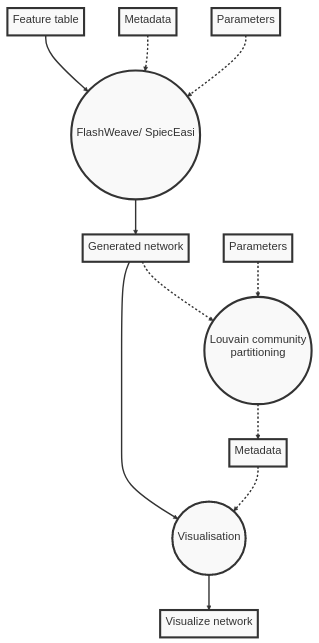

# Summary

**q2-makarsa** is a plugin for the QIIME 2 microbiome bioinformatics platform.
The plugin allows biologists to infer and visualise microbial
ecological networks from compositional data. Ecological networks provide a
method for detecting community structure and identifying key species, peptides,
or any biologically meaningful covariates.

# Statement of need

The bacteria, fungi, viruses, and other microbes that inhabit a specific
habitat are known collectively as a microbiome. The microbiomes that occupy the
human body crucially impact human health in positive and negative ways
[@berg2020microbiome]. Microbe-microbe and host-microbe interactions may play a
significant role in many areas; for example, food science
[@singh2017microbiome], health
science [@vanevery2023microbiome], and agricultural production
[@berg2020microbiome]. Understanding the functions, interactions, temporal and
spatial structures, and population dynamics of microbial communities, will lead
to breakthroughs in those areas. To discover the interactions among microbiota
within or between ecosystems, network analysis is an important starting point.
It allows us to investigate questions from the species level to the community
level within a common formal mathematical framework [@delmas2019analysing].
Here, we present a QIIME 2 plugin [@Bolyen2019] that will help to infer
microbial interactions by using network analysis.

**q2-makarsa** makes two popular microbial network inference methods,
SpiecEasi [@kurtz2015sparse] and FlashWeave [@tackmann2019rapid],  
available to users of the [QIIME 2](https://qiime2.org/) bioinformatics 
platform and bundles it with a new tool
for visualising the inferred networks and a method 
to obtain node communities based on the Louvain algorithm [@Blondel_2008].
By bringing these methods into the QIIME 2 platform, users can take data from 
laboratory to plot without breaking QIIME 2's distributed provenance tracking,
improving scientific reproducibility. QIIME 2 also provides users with greater
convenience by allowing non-specialists to access tools via any of QIIME 2's
interfaces, such as the command line or a graphical user interface,
rather than from R or Julia, greatly increasing their usability and audience.
Additionally, by providing users easy access to these competing methods
of network inference, users can compare and assess the robustness of
network inference on their data.

# Summary of functionality

SpiecEasi has been widely adopted by the microbiome research community and
has been cited in over 1000 scientific publications
([Google Scholar](https://scholar.google.com.au/)). SpiecEasi
has been rigorously tested and benchmarked against other methods for microbial
network analysis and has been shown to perform well across a variety of
datasets and scenarios.

FlashWeave [@tackmann2019rapid] is a newer package
used for microbial network analysis, and it is gaining popularity and
acceptance in the scientific community for its novel algorithm, large-scale
analysis, and multiomics integration properties.

Both network inference packages are actively
developed and maintained by dedicated teams of developers, which means that
they are regularly updated and improved with new features and bug fixes.

Integration of SpiecEasi and FlashWeave with the QIIME 2 platform makes it 
straightforward to use them to infer networks between a variety of data types
such as amplicon sequence variants (ASVs), operational taxonomic units (OTUs),
taxa, or peptides. SpiecEasi's cross-domain inference feature
can also infer networks across data types, and FlashWeave can incorporate metadata
in its networks via metavariables.

To simplify the complexity of the network a widely used approach is to obtain
a community partition of nodes. For this goal the Louvain algorithm 
[@Blondel_2008] is widely used, which is implemented in the python library 
Networkx [@SciPyProceedings_11]. This algorithm maximizes the modularity to 
obtain the communities and is not deterministic. It has also been shown that 
a consensus of multiple partitions obtained from the same clustering method 
yields more stable and accurate results than a single partition [@Lancichinetti2012].

**q2-makarsa** exposes SpiecEasi and FlashWeave via the
QIIME 2 actions `spiec-easi` and
`flashweave` respectively. Additionally it enables exploring the community 
structure of the network via the `louvain-communities` action.
Specifically, **q2-makarsa** makes available: 

* All of [SpiecEasi's](https://github.com/zdk123/SpiecEasi) features except
  batch-mode execution (thread-level parallelism is supported);
* [FlashWeave's](https://github.com/meringlab/FlashWeave.jl) `learn_network`
  features in their entirety.
* A consensus of Louvain community partitions [@Lancichinetti2012].

The QIIME 2 visualizer `visualise-network` takes an inferred network as input and
generates a publication-quality figure. This option combined with
QIIME 2 `view` tool allows the user to understand the inferred ecological 
network in a variety of ways.

`visualise-network` offers a number of features customized for making sense
of microbial interactions, for example,

* The network is interactive and its overall size and shape on the screen can
  be manipulated manually within the user's browser.
* A publication-ready image of the network can be saved to the local device in
  PNG format.
* Node attributes can be added via feature metadata (eg. taxonomy, DNA
  sequence, differential abundance scores) and displayed via node size or colour.
* If the node attributes are taxonomic labels, visualisation offers colourings at
  any taxonomic level.
* Full statistics for each network node, including metadata and various
  network centrality measures, can be displayed by selecting individual nodes.
* Network edges are colour coded for positive (blue) and negative (orange)
  correlations
* Edge thickness is scaled according to statistics appropriate to each method
  with thicker edges indicating stronger associations between features.
* Disjoint inferred networks are displayed in their own tabs.
* Settings are synchronised across tabs meaning that if you have multiple tabs
  open in the visualisation, any changes you make to the settings (such as the
  scaling of edges or nodes) will be applied to all tabs at once.

\autoref{fig:visual} is an example of a PNG image saved directly from
the visualiser. This figure is a visualisation of the networks inferred from the 
QIIME 2 Parkinson's Mouse Tutorial data [@pdmice] using FlashWeave. Nodes represent
amplicon sequence variants (ASVs), are coloured by taxonomic classification, and 
are sized proportional to their ANCOM W statistic [@mandal2015analysis].
In this instance the ANCOM W statistic gives an indication of how differentially
abundant ASVs are between healthy and Parkinson's Disease-affected donor mice.

The plugin workflows are summarised in \autoref{fig:grl}.

{width=100%}

{width=40%}  

The plugin is freely available under the [BSD-3-Clause license](https://github.com/BenKaehler/q2-makarsa/blob/main/LICENSE).
SpiecEasi and FlashWeave must be installed and used under their licensing restrictions.
Installation instructions, a usage tutorial, and example outputs are given on the [project
website](https://isaactowers.github.io/q2-makarsa/).

# Comparison with other similar packages

Many network visualisation tools exist. For instance, the SpiecEasi documentation recommends
igraph [@csardi2006igraph] and the FlashWeave documentation recommends Cytoscape [@shannon2003cytoscape]
or Gephi [@bastian2009gephi]. **q2-makarsa** differs from this approach by combining those inference
tools with a customised visualisation tool and community detection without the need for the
user to code in R or Julia.

Other pipelines exist that are more similar to **q2-makarsa**, for instance MicNet [@favila2022micnet],
CoNet [@faust2016conet], and NetCoMi [@peschel2021netcomi]. MicNet offers a web interface, similar tools,
and an active GitHub repository. CoNet is a Cytoscape plugin that can perform inference on microbial
count data. NetCoMi is an R package that provides access to similar tools (notably SpiecEasi) and is also
actively maintained.

These pipelines offer varying features. **q2-makarsa** is distinguished by being a plugin for the popular
QIIME 2 microbiome bioinformatics platform, giving users access to multiple user interfaces, interactive 
provenance tracking, interoperability, and other benefits. It also uniquely offers access to FlashWeave
and consensus Louvain community detection.

# Acknowledgements

The authors acknowledge support from University of Dhaka, Bangladesh and UNSW
Canberra, Australia. This work is a partial fulfilment of PhD research at
UNSW Canberra.

# References

