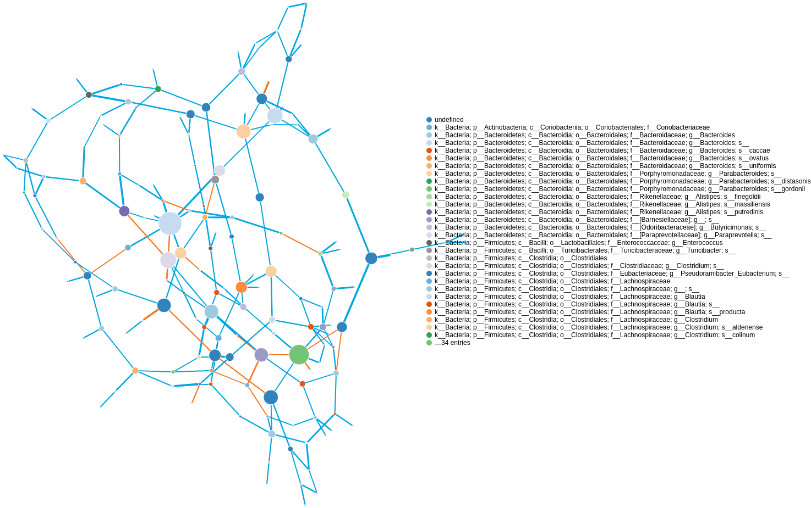
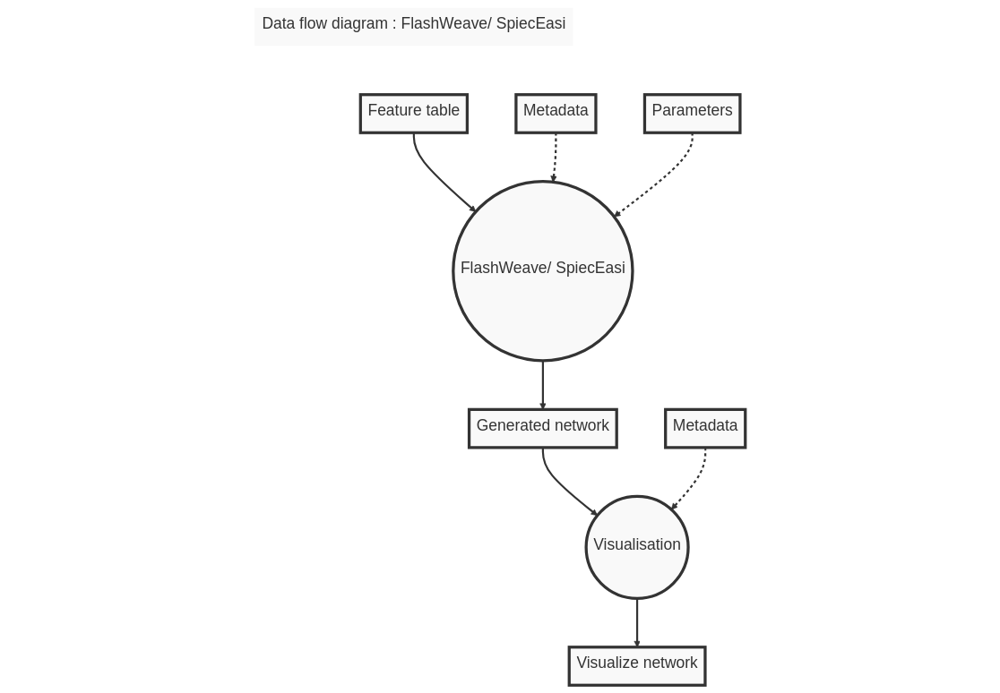

# Summary

**q2-makarsa** is a plugin for the QIIME 2 microbiome bioinformatics platform.
The plugin allows the QIIME 2 community to infer and visualise microbial
ecological networks from compositional data. Ecological networks provide a
method for detecting community structure and identifying key species, peptides,
or any biologically meaningful covariates.

# Statement of need

The bacteria, fungi, viruses, and other microbes that inhabit a specific
habitat are known collectively as a microbiome. The microbiomes that occupy the
human body crucially impact human health in positive and negative ways
[@berg2020microbiome]. Microbe-microbe and host-microbe interactions may play a
significant role in many areas; for example, food science
[@singh2017microbiome; @torrazza2011developing; @foodsecurity2017], health
science [@torrazza2011developing; @diease2011] and agricultural production
[@berg2020microbiome]. Understanding the functions, interactions, temporal and
spatial structures, and population dynamics of microbial communities, will lead
to breakthroughs in those areas. To discover the interactions among microbiota
within or between ecosystems, network analysis is an important starting point.
It allows us to investigate questions from the species level to the community
level within a common formal mathematical framework [@delmas2019analysing].
Here, we present a QIIME 2 plugin [@Bolyen2019] that will help to infer
microbial interactions by using network analysis.

**q2-makarsa** makes available the functionality of SpiecEasi
[@kurtz2015sparse] and FlashWeave [@tackmann2019rapid], two popular tools for
microbial network analysis, within the QIIME 2 microbiome bioinformatics
platform. Among currently available microbial network analysis tools, SpiecEasi
has been comparatively widely adopted by the microbiome research community and
has been cited in almost 1004 scientific publications [@google2023]. SpiecEasi
has been rigorously tested and benchmarked against other methods for microbial
network analysis and has been shown to perform well across a variety of
datasets and scenarios. FlashWeave [@tackmann2019rapid] is another new package
used for microbial network analysis, and it is gaining popularity and
acceptance in the scientific community for its novel algorithm, large-scale
analysis, and multinomics integration properties. Both packages are actively
developed and maintained by dedicated teams of developers, which means that
they are regularly updated and improved with new features and bug fixes.
Overall, SpiecEasi and FlashWeave are powerful tools for analyzing microbial
data and identifying potential interactions between microbial taxa.

The current version of **q2-makarsa** exposes the two methods for network
inference SpiecEasi and FlashWeave by the parameter options `spiec-easi` and
`flashweave` respectively. Specifically, **q2-makarsa** makes available: 

* All of [SpiecEasi's](https://github.com/zdk123/SpiecEasi) features except
  batch-mode execution (thread-level parallelism is supported);
* [FlashWeave's](https://github.com/meringlab/FlashWeave.jl) `learn_network`
  features in their entirety. 

The universal visualisation method is accessed by the option
`visualise-network`, which takes generated network as input and
visualizes it in a publication-quality figure. This option combined with
QIIME 2 `view` tool allows the user to understand the inferred ecological 
network is a variety of ways.

* The network is interactive and its overall size and shape on the screen can
  be manipulated manually within the user's browser.
* A publication ready image of the network can be saved to the local device in
  PNG format.
* Network nodes can be selected and information on which feature (eg. ASVs,
  OTUs, MVs, taxa, peptides)  is represented by the node, statistics, and
  various centrality measures for the node will be displayed.
* Network edges are colour coded for positive (blue) and negative (orange)
  correlations
* Edge thickness is scaled according to statistics appropriate to each method
  with thicker edges indicating stronger connections between features.
* Node size is scaled according user-selected statistics such as centrality
  measures.
* Nodes are colour coded according to user-selected categories such as
  taxonomic classification
* Settings are synchronised across tabs meaning that if you have multiple tabs
  open in the visualisation, any changes you make to the settings (such as the
  scaling of edges or nodes) will be applied to all tabs at once.
* Node attributes can be added via feature metadata (eg. taxonomy, DNA
  sequence, differential abundance scores). If the node attributes are
  taxonomic labels, visualisation offers colourings at any taxonomic level

The following figure \autoref{fig:visual} represent a particular state of output
generated by the visualizer. In this figure, we have used betweenness centrality as network
node size, and weights of interactions between any two species as the width of edges in the network.
Users can access all the options mentioned above through QIIME 2 `view` tool and can change these
options according to their need to produce a publication-quality figure.
From this visualized network, it is obvious which node (taxa) has more influence, and which node(taxa)
has more interactions in the microbial community represented by the given data.
{width=40%}

{width=40%}  
{width=40%}

The standard workflow and an overview of this plugin are shown in
\autoref{fig:grl}.The plugin is freely available under the BSD-3-Clause license at
. The installation procedures and usage 
instructions are explained on GitHub page of this plugin.

# Acknowledgements

The authors acknowledge support from University of Dhaka, Bangladesh and UNSW
Canberra, Australia. This work is a partial fulfilment of PhD research at
UNSW Canberra.

# References

